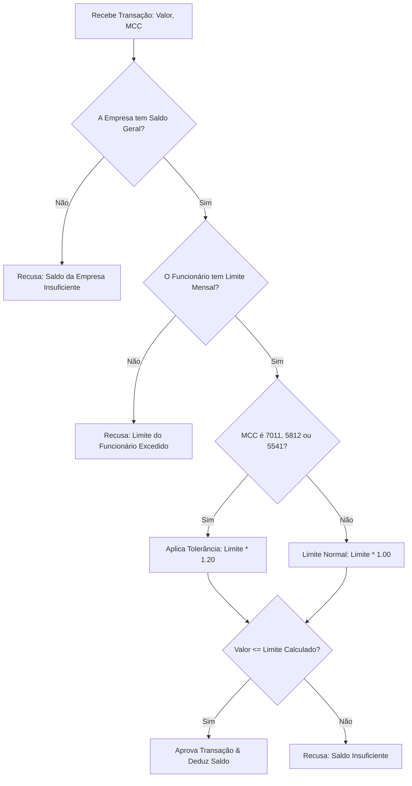

# Anotações


### Regras de saldo e limite

**`limit_remaining`**

É o limite mensal do cartão menos a soma das reservas ativas e dos valores capturados no mês.

```text
limit_remaining =
    monthly_limit
    - active_reservations
    - captured_amount
```

Uma captura não reduz o limite novamente quando a reserva correspondente já foi criada. A captura transforma parte do valor reservado em valor efetivamente consumido.

**`available`**

É o menor valor entre o `limit_remaining` do cartão e o saldo disponível da empresa.

```text
available =
    min(limit_remaining, company_available)
```

O limite do cartão não representa dinheiro previamente separado para o funcionário. O saldo financeiro pertence à empresa; o limite é uma restrição individual de consumo.

**Transactions**

Toda movimentação financeira que altera o limite ou o saldo da empresa é registrada como uma transaction imutável.

Os tipos financeiros utilizados serão:

* `reserve`: cria uma reserva, reduzindo o valor disponível;
* `release`: libera uma reserva;
* `capture`: registra o valor efetivamente consumido.

Uma cancellation não será uma transaction financeira própria. Ela é um evento da rede que pode gerar uma transaction `release` para liberar o valor ainda reservado.

**Captura**

Para uma captura parcial, primeiro é liberado o valor correspondente da reserva e depois registrado o valor capturado.

Exemplo: autorização de R$800 e capture de R$300:

```text
reserve  -R$800
release  +R$300
capture  -R$300
```

Após isso:

```text
reservado = R$500
capturado = R$300
```

O impacto líquido no limite permanece em R$800, pois R$300 apenas deixou de estar reservado e passou a estar efetivamente consumido.

**Captura acima da reserva**

Se uma captura for maior que o valor ainda reservado, primeiro é liberado todo o valor reservado e o restante é debitado como captura.

Exemplo: autorização de R$800 com captura acumulada de R$860:

```text
reserva restante = R$200

release  +R$200
capture  -R$260
```

Ao final:

```text
reserva = R$0
capturado = R$860
```

O valor capturado deve respeitar a tolerância definida para o MCC.

**Cancellation após captura parcial**

Uma cancellation libera somente o valor que ainda estiver reservado. Os valores já capturados permanecem consumidos.

Exemplo:

```text
authorization = R$800
capture       = R$300
cancellation
```

Resultado:

```text
capturado = R$300
reservado = R$0
```

A cancellation gera:

```text
release +R$500
```

**Reference**

A propriedade `reference` de uma transaction contém o `id` da authorization ou do event que originou a movimentação.

Isso permite rastrear cada movimentação financeira até sua origem.

**Idempotência**

O mesmo `authorization.id` não cria uma nova reserva quando reenviado.

O mesmo `event.id` não pode gerar novamente as transactions correspondentes quando reenviado.

**Eventos fora de ordem**

Se um event chegar antes da authorization correspondente, o event será persistido como pendente e não produzirá movimentação financeira até que a authorization seja conhecida. Quando a authorization chegar, o evento pendente poderá ser processado.

**Transactions imutáveis**

Depois de registrada, uma transaction não será alterada nem removida. Correções financeiras serão representadas por novas transactions relacionadas ao evento que as originou.

Fluxo de aprovação de tolerância dos MCCs 7011, 5812 ou 5541




[//]: #
