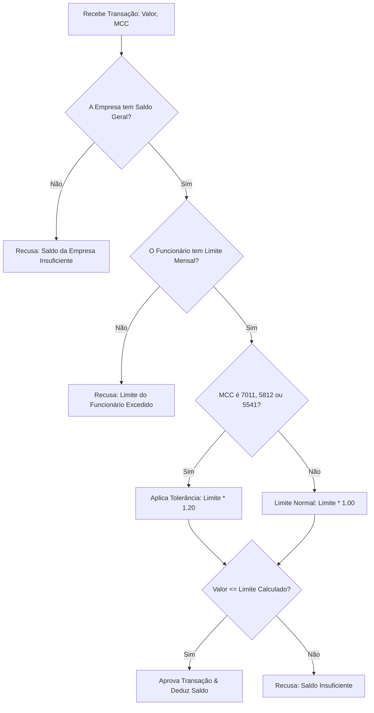

# Anotações

### Regras de saldo e limite

**`limit_remaining`**

É o limite mensal do cartão menos a soma das reservas ativas e dos valores capturados no mês.

```text
limit_remaining =
    monthly_limit
    - active_reservations
    - captured_amount
```

Uma captura não reduz o limite novamente quando a reserva correspondente já foi criada. A captura transforma parte do valor reservado em valor efetivamente consumido.

**`available`**

É o menor valor entre o `limit_remaining` do cartão e o saldo disponível da empresa.

```text
available =
    min(limit_remaining, company_available)
```

O limite do cartão não representa dinheiro previamente separado para o funcionário. O saldo financeiro pertence à empresa; o limite é uma restrição individual de consumo.

**Transactions**

Toda movimentação financeira que altera o limite ou o saldo da empresa é registrada como uma transaction imutável.

Os tipos financeiros utilizados serão:

- `reserve`: cria uma reserva, reduzindo o valor disponível;
- `release`: libera uma reserva;
- `capture`: registra o valor efetivamente consumido.

Uma cancellation não será uma transaction financeira própria. Ela é um evento da rede que pode gerar uma transaction `release` para liberar o valor ainda reservado.

**Captura**

Para uma captura parcial, primeiro é liberado o valor correspondente da reserva e depois registrado o valor capturado.

Exemplo: autorização de R$800 e capture de R$300:

```text
reserve  -R$800
release  +R$300
capture  -R$300
```

Após isso:

```text
reservado = R$500
capturado = R$300
```

O impacto líquido no limite permanece em R$800, pois R$300 apenas deixou de estar reservado e passou a estar efetivamente consumido.

**Captura acima da reserva**

Se uma captura for maior que o valor ainda reservado, primeiro é liberado todo o valor reservado e o restante é debitado como captura.

Exemplo: autorização de R$800 com captura acumulada de R$860:

```text
reserva restante = R$200

release  +R$200
capture  -R$260
```

Ao final:

```text
reserva = R$0
capturado = R$860
```

O valor capturado deve respeitar a tolerância definida para o MCC.

**Cancellation após captura parcial**

Uma cancellation libera somente o valor que ainda estiver reservado. Os valores já capturados permanecem consumidos.

Exemplo:

```text
authorization = R$800
capture       = R$300
cancellation
```

Resultado:

```text
capturado = R$300
reservado = R$0
```

A cancellation gera:

```text
release +R$500
```

**Reference**

A propriedade `reference` de uma transaction contém o `id` da authorization ou do event que originou a movimentação.

Isso permite rastrear cada movimentação financeira até sua origem.

**Idempotência**

O mesmo `authorization.id` não cria uma nova reserva quando reenviado.

O mesmo `event.id` não pode gerar novamente as transactions correspondentes quando reenviado.

**Eventos fora de ordem**

Se um event chegar antes da authorization correspondente, o event será persistido como pendente e não produzirá movimentação financeira até que a authorization seja conhecida. Quando a authorization chegar, o evento pendente poderá ser processado.

**Transactions imutáveis**

Depois de registrada, uma transaction não será alterada nem removida. Correções financeiras serão representadas por novas transactions relacionadas ao evento que as originou.

Fluxo de aprovação de tolerância dos MCCs 7011, 5812 ou 5541



### Testes:

1. `POST /api/network/authorizations` — **Authorization**

| #   | Regra                                      | Resultado esperado                       | Teste                                                                                 |
| --- | ------------------------------------------ | ---------------------------------------- | ------------------------------------------------------------------------------------- |
| A1  | Mesmo`id`recebido novamente                | Mesma`decision`, sem nova reserva        | `returns the existing authorization when the external id was already processed`       |
| A2  | Token inexistente                          | `DECLINED`+`CARD_NOT_FOUND`, sem reserva | `declines the authorization when the card does not exist`                             |
| A3  | Cartão bloqueado                           | `DECLINED`+`CARD_BLOCKED`, sem reserva   | `declines the authorization when the card is blocked`                                 |
| A4  | MCC bloqueado para o cartão                | `DECLINED`+`MCC_BLOCKED`, sem reserva    | `declines the authorization when the MCC is blocked for the card`                     |
| A5  | Valor acima do teto por compra             | `DECLINED`+`PURCHASE_LIMIT_EXCEEDED`     | `declines the authorization when the amount exceeds the purchase limit`               |
| A6  | Valor acima do limite mensal restante      | `DECLINED`, sem reserva                  | `declines the authorization when the amount exceeds the remaining monthly card limit` |
| A7  | Valor acima do saldo disponível da empresa | `DECLINED`, sem reserva                  | `declines the authorization when the amount exceeds the company available balance`    |
| A8  | Todas as regras satisfeitas                | `APPROVED`+ Authorization criada         | `approves the authorization when all authorization rules are satisfied`               |
| A9  | Authorization aprovada                     | Reserva amount no cartão e empresa       | `creates the reservation transactions when the authorization is approved`             |
| A10 | Autorizações simultâneas no mesmo cartão   | Nunca aprova além do disponível          | `does not approve concurrent authorizations beyond the available card limit`          |

2. Capture

**Endpoint:** `POST /api/network/captures`

Aqui ficam tanto os captures normais quanto os eventos que chegam fora de ordem.

| #   | Regra                                 | Resultado esperado                                 | Teste                                                                                 |
| --- | ------------------------------------- | -------------------------------------------------- | ------------------------------------------------------------------------------------- |
| C1  | Capture de Authorization aprovada     | Capture realizado                                  | `captures an authorized transaction`                                                  |
| C2  | Capture parcial                       | Libera a reserva correspondente e registra capture | `partially captures an authorization and releases the corresponding reservation`      |
| C3  | Múltiplos captures parciais           | Permite vários captures dentro do limite           | `allows multiple partial captures of the same authorization`                          |
| C4  | Capture final                         | Libera toda a reserva restante                     | `releases the remaining reservation when the authorization is fully captured`         |
| C5  | Capture antes da Authorization        | Evento fica pendente                               | `keeps a capture pending when its authorization has not been received`                |
| C6  | Authorization chega depois do Capture | Processa a pendência                               | `processes a pending capture after its authorization is received`                     |
| C7  | Capture duplicado                     | Nenhum efeito financeiro adicional                 | `does not apply the same capture event twice`                                         |
| C8  | Capture acima do autorizado           | Respeita teto permitido                            | `does not allow a capture above the authorization tolerance`                          |
| C9  | MCC com tolerância de 20%             | Permite até`authorization + 20%`                   | `allows capture within the configured MCC tolerance`                                  |
| C10 | MCC sem tolerância                    | Não permite excedente                              | `does not allow capture above the authorization amount when the MCC has no tolerance` |

3. Cancellation

**Endpoint:** `POST /api/network/cancellations`

| #   | Regra                             | Resultado esperado                 | Teste                                                                      |
| --- | --------------------------------- | ---------------------------------- | -------------------------------------------------------------------------- |
| X1  | Cancelamento sem capture          | Libera toda a reserva              | `releases the full reservation when an authorization is cancelled`         |
| X2  | Cancelamento após capture parcial | Libera somente o restante          | `releases only the remaining reservation after a partial capture`          |
| X3  | Cancelamento duplicado            | Nenhum efeito financeiro adicional | `does not apply the same cancellation twice`                               |
| X4  | Cancelamento após captura total   | Não libera valor adicional         | `does not release funds after a fully captured authorization is cancelled` |

4. Cross-month

Isso não é um endpoint separado. São regras que serão testadas principalmente através do Capture.

| #   | Regra                                         | Endpoint                     | Teste                                                                                 |
| --- | --------------------------------------------- | ---------------------------- | ------------------------------------------------------------------------------------- |
| M1  | Authorization em um mês e capture no seguinte | `POST /api/network/captures` | `keeps the authorization reservation tied to its original month`                      |
| M2  | Capture coberto pela Authorization            | `POST /api/network/captures` | `does not consume the capture month limit for an amount covered by the authorization` |
| M3  | Capture excede o valor autorizado             | `POST /api/network/captures` | `consumes the capture month limit only for the amount exceeding the authorization`    |
| M4  | Capture dividido entre períodos               | `POST /api/network/captures` | `allocates the captured amount to the correct limit periods`                          |

```
POST /api/network/authorizations
        │
        ├── A1 Idempotência
        ├── A2 Card inexistente
        ├── A3 Card bloqueado
        ├── A4 MCC bloqueado
        ├── A5 Teto por compra
        ├── A6 Limite mensal
        ├── A7 Saldo empresa
        ├── A8 Aprovação
        ├── A9 Reservas
        └── A10 Concorrência
                 │
                 ▼
POST /api/network/captures
        │
        ├── C1–C10
        └── M1–M4 (cross-month)
                 │
                 ▼
POST /api/network/cancellations
        │
        └── X1–X4
```

.....
.....
