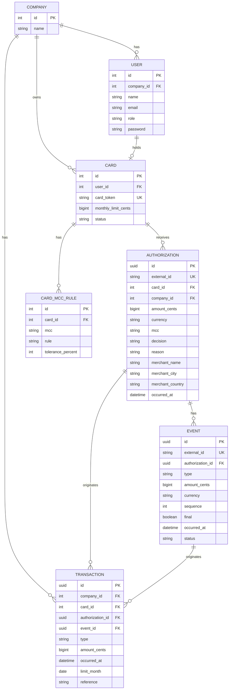

### Descrição dos atributos

**User**

| Campo        | Descrição                                                                                                                                                                |
| ------------ | ------------------------------------------------------------------------------------------------------------------------------------------------------------------------ |
| `role`       | Define o papel do usuário no sistema. Os valores esperados são`admin`para usuários administrativos da empresa e`cardholder`para usuários que possuem cartão corporativo. |
| `company_id` | Identifica a empresa à qual o usuário pertence.                                                                                                                          |
| `card_id`    | Identifica o cartão do portador, quando o usuário possuir um cartão.                                                                                                     |

**Card**

| Campo                  | Descrição                                                                                                                            |
| ---------------------- | ------------------------------------------------------------------------------------------------------------------------------------ |
| `status`               | Estado do cartão. Os valores usados pelo domínio são`active`e`blocked`. Um cartão`blocked`não pode gerar uma authorization aprovada. |
| `monthly_limit_cents`  | Limite mensal nominal do cartão, armazenado em centavos para evitar problemas de precisão monetária.                                 |
| `card_token`           | Identificador/token usado pela rede para identificar o cartão sem expor seus dados reais.                                            |
| `purchase_limit_cents` | Limite máximo permitido para uma única autorização de compra, em centavos. Diferente do limite mensal.                               |

**CARD_MCC_RULE**

| Campo               | Descrição                                                                         |
| ------------------- | --------------------------------------------------------------------------------- |
| `id`                | Identificador interno da regra.                                                   |
| `card_id`           | Identificador do cartão ao qual a regra de MCC pertence.                          |
| `mcc`               | Merchant Category Code ao qual a regra se aplica.                                 |
| `rule`              | Tipo de regra aplicada ao MCC, como bloqueio ou tolerância de captura.            |
| `tolerance_percent` | Percentual de tolerância permitido para captura quando a regra for de tolerância. |

**Authorization**

| Campo          | Descrição                                                             |
| -------------- | --------------------------------------------------------------------- |
| `decision`     | Resultado da autorização:`approved`ou`declined`.                      |
| `reason`       | Motivo da decisão quando necessário, principalmente em uma recusa.    |
| `mcc`          | Merchant Category Code utilizado nas regras de bloqueio e tolerância. |
| `amount_cents` | Valor solicitado pela rede, em centavos.                              |
| `occurred_at`  | Momento em que a authorization ocorreu na rede.                       |

**Event**

| Campo              | Descrição                                                                                                                                                                        |
| ------------------ | -------------------------------------------------------------------------------------------------------------------------------------------------------------------------------- |
| `type`             | Tipo do evento. No desafio:`capture`ou`cancellation`.                                                                                                                            |
| `status`           | Estado de processamento interno do evento. Pode ser`pending`,`processed`ou`failed`, permitindo persistir um evento recebido antes da authorization e processá-lo posteriormente. |
| `sequence`         | Ordem do evento dentro da sequência de eventos daquela authorization. É importante para múltiplas captures e eventos fora de ordem.                                              |
| `final`            | Indica se a capture encerra a autorização. Enquanto`false`, uma parte da reserva pode permanecer ativa.                                                                          |
| `occurred_at`      | Momento em que o evento aconteceu na rede, independentemente de quando nossa API recebeu a requisição.                                                                           |
| `authorization_id` | Authorization à qual o evento pertence.                                                                                                                                          |

**Transaction**

| Campo          | Descrição                                                                                                                                                     |
| -------------- | ------------------------------------------------------------------------------------------------------------------------------------------------------------- |
| `type`         | Tipo do movimento financeiro:`deposit`,`reserve`,`release`,`capture`ou`cancellation`.                                                                         |
| `amount_cents` | Valor do movimento, em centavos. O sinal financeiro é determinado pelo tipo da transaction.                                                                   |
| `reference`    | Identificador da origem do movimento. Pode referenciar a authorization ou o event responsável pela transaction.                                               |
| `limit_month`  | Mês de limite ao qual o movimento pertence. É diferente de`occurred_at`, pois uma capture no mês seguinte pode continuar pertencendo ao mês da authorization. |
| `occurred_at`  | Momento em que o movimento financeiro foi registrado/ocorreu.                                                                                                 |

| `rule`              | Descrição                                                   |
| ------------------- | ----------------------------------------------------------- |
| `blocked`           | O MCC é bloqueado para o cartão.                            |
| `capture_tolerance` | O MCC permite uma tolerância percentual no valor capturado. |

Para o `tolerance_percent`, quando a regra não for de tolerância, podemos usar `0`.
